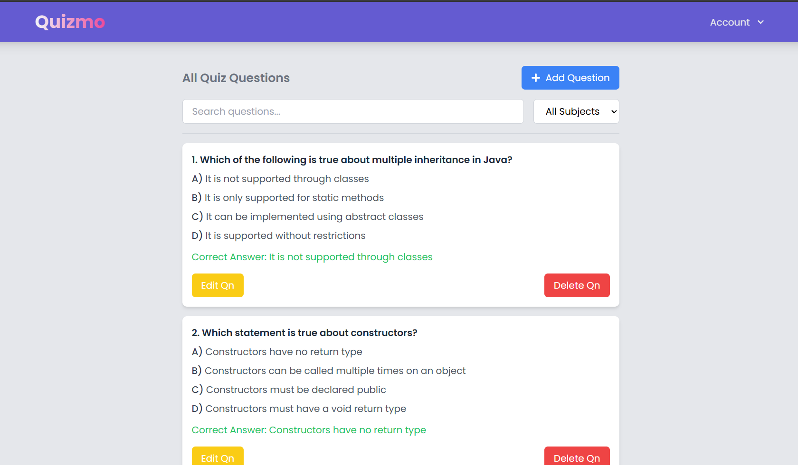

# Quizmo – Full Stack Quiz Application

**Quizmo** is a modern, full-stack quiz platform that enables engaging quiz experiences for users and streamlined administration for quiz creators. Built with React, Spring Boot, and PostgreSQL, Quizmo demonstrates secure, scalable, and containerized application architecture.

---

## 🚀 Live Demo

[Live Demo](https://quizmo75.vercel.app/)

---

## 🚀 Executive Summary

Quizmo empowers both administrators and users—admins can create and manage quizzes, while users can participate in a variety of categorized quizzes, track their progress, and challenge themselves with timers. 

---

## 🛠️ Technologies Used

- **Frontend:** React.js, Tailwind CSS
- **Backend:** Spring Boot (Java), RESTful APIs
- **Database:** MySQL
- **Authentication:** JWT-based, role-based access
- **Deployment:** Frontend (Vercel) ,Backend (Render using docker image)

---

## 🎯 Key Features

- **Role-based Access:** Secure admin and user separation with JWT
- **Fully Responsive UI:** Accessible on all devices
- **Quiz Categorization:** Organized, easy-to-navigate quizzes
- **Score Tracking:** Real-time progress and history
- **Timer Challenges:** Adds excitement and difficulty
- **Admin Dashboard:** Manage quizzes, questions, and categories

---

## 🗺️ Architecture Overview


**Architecture Explanation:**

- **User (Browser):** Accesses the application through a modern web browser.
- **Frontend (React.js + Tailwind CSS):**  
  - Served as a static site ( via Vercel ).  
  - Communicates with the backend API using HTTPS and includes JWT in requests.
- **Backend API (Spring Boot):**  
  - Exposes RESTful endpoints for quiz management, user authentication, scoring, etc.  
  - Handles role-based access control (admin/user) using JWT tokens.
- **Database (MySQL):**  
  - Stores users, quizzes, questions, scores, categories, and more.
- **Authentication (JWT):**  
  - On login, backend issues JWT, which the frontend stores and attaches to API requests.
---

## 🖼️ Screenshots




---

## 💡 Key Learnings & Challenges

- Implemented secure JWT authentication and role-based permissions.
- Designed RESTful APIs and ensured seamless frontend-backend integration.
- Learned about entity-relationship mapping.
- Solved CORS, environment variable management.

---

## 📂 Project Setup

### 1. Clone the Repository
```bash
git clone https://github.com/sreenand76/QuizApp.git
cd QuizApp 
```
### 2. Setup the Frontend
```bash
cd QuizApp-frontend
npm install
npm run dev
```
### 3. Setup the Backend
```bash
cd QuizApp-Backend
mvn clean install
mvn spring-boot:run
```
---

### Sample Credentials

- **Admin:** admin@example.com / admin123
- **User:** user@example.com / user123

---

## 🔮 Future Scope

- Integrate social media sharing for quiz results.
- Enable quiz export in PDF/Excel formats.
- Add support for image and multimedia questions.

---

## 🤝 Contribution / Contact

Feedback and collaboration are welcome!  
Connect with me on [LinkedIn](https://www.linkedin.com/in/sreenand-s-9b2716292/) or email at sreenands93@gmail.com.

---


